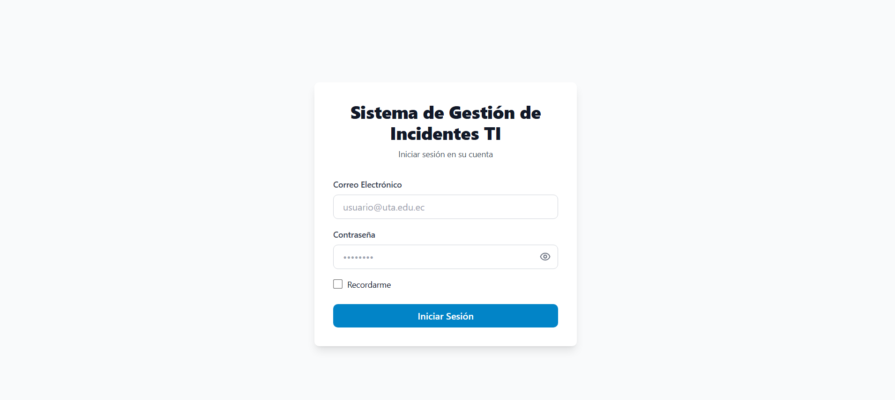
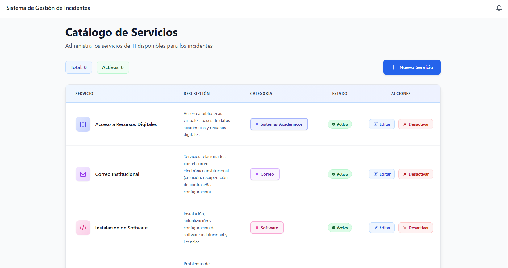
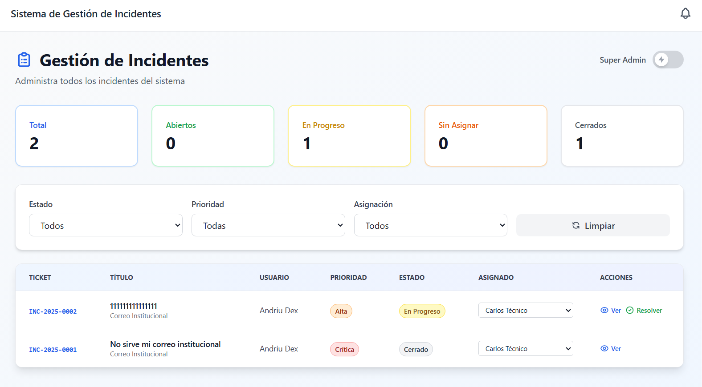
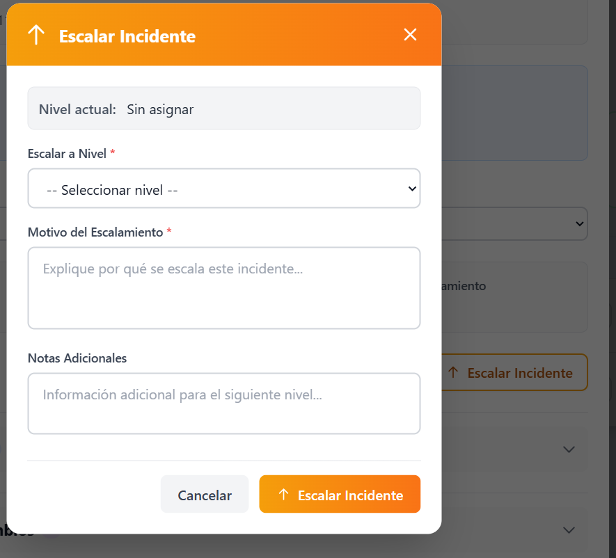
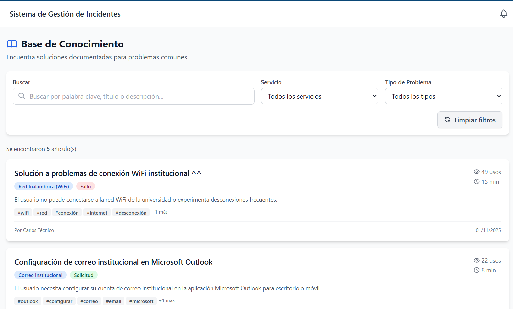
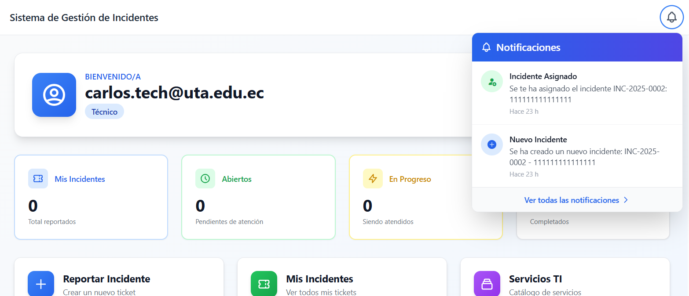
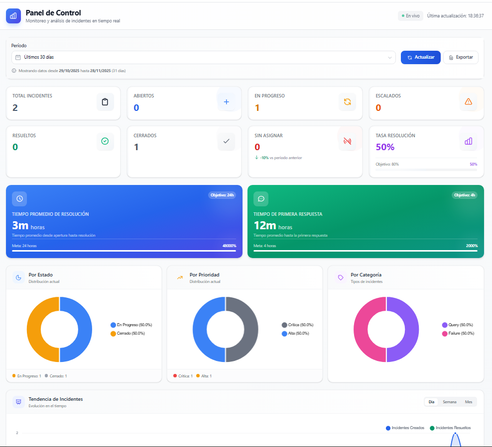
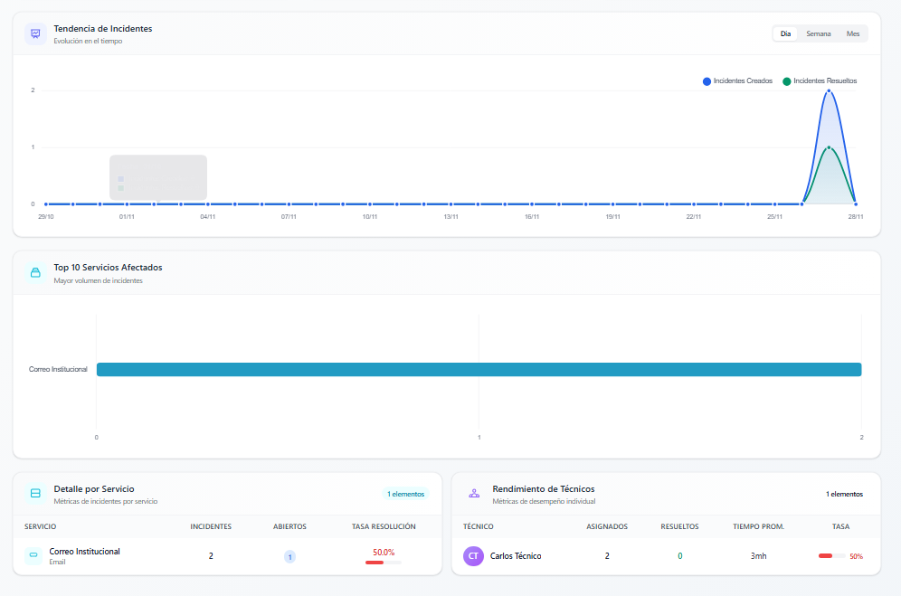

# 🎫 IncidentsTI - Sistema de Gestión de Incidentes de TI

<div align="center">


**Sistema integral de gestión de incidentes y base de conocimiento para la Oficina de TI**

[Características](#-características) •
[Tecnologías](#-tecnologías) •
[Instalación](#-instalación) •
[Uso](#-uso) •
[Documentación](#-documentación) •
[Contribuir](#-contribuir)

</div>

---

## 📋 Descripción

**IncidentsTI** es un sistema de gestión de incidentes de TI (Help Desk / Service Desk) desarrollado para la Universidad Técnica de Ambato (UTA). El sistema permite registrar, dar seguimiento, escalar y resolver incidentes de TI, además de mantener una base de conocimiento con soluciones documentadas.

El proyecto fue diseñado siguiendo principios de **ISO 9241** (ergonomía), **Diseño Centrado en Usuario (DCU)** y **WCAG 2.1** (accesibilidad), con el objetivo de ser evaluado mediante el modelo **TAM (Technology Acceptance Model)**.

---

## ✨ Características

### 🔐 Autenticación y Roles
- Sistema de login seguro con ASP.NET Core Identity
- 4 roles: Administrador, Técnico, Docente, Estudiante
- Gestión de usuarios (crear, activar/desactivar)
- Protección de rutas basada en roles



### 📂 Catálogo de Servicios
- 6 categorías de servicios de TI
- CRUD completo de servicios
- Asociación obligatoria servicio-incidente



### 🎫 Gestión de Incidentes
- Generación automática de tickets (INC-YYYY-NNNN)
- 5 estados: Abierto, En Progreso, Escalado, Resuelto, Cerrado
- 4 prioridades: Baja, Media, Alta, Crítica
- 3 tipos: Falla, Consulta, Requerimiento
- Asignación de técnicos
- Vista personalizada por rol



### 📜 Trazabilidad Completa
- Historial automático de cambios
- Registro de todas las acciones
- Sistema de comentarios (públicos e internos)
- Auditoría de escalamientos


### ⬆️ Sistema de Escalamiento
- 3 niveles de escalamiento
- Registro de motivos y notas
- Notificaciones automáticas



### 📚 Base de Conocimiento
- Artículos con pasos de solución
- Búsqueda por palabras clave
- Vinculación con incidentes
- Contador de usos



### 🔔 Notificaciones In-App
- Campana de notificaciones en tiempo real
- 10 tipos de notificaciones
- Marcar como leídas individual/masivamente
- Auto-refresh cada 30 segundos



### 📊 Dashboard de Estadísticas
- KPIs en tiempo real
- Gráficos interactivos con Chart.js
- Métricas de tiempo de resolución
- Rendimiento por técnico y servicio
- Exportación a PDF y Excel con gráficos




### 🎨 UI/UX Moderno
- Diseño responsive (móvil, tablet, desktop)
- Búsqueda global con atajos de teclado
- Sistema de breadcrumbs
- Componentes reutilizables
- Accesibilidad WCAG 2.1 nivel AA

---

## 🛠️ Tecnologías

### Backend
| Tecnología | Versión | Uso |
|------------|---------|-----|
| .NET | 8.0 | Framework principal |
| Blazor Server | - | UI interactiva |
| ASP.NET Core Identity | 8.0 | Autenticación |
| Entity Framework Core | 8.0.11 | ORM |
| MediatR | 13.1.0 | Patrón CQRS |
| SQL Server | - | Base de datos |

### Frontend
| Tecnología | Versión | Uso |
|------------|---------|-----|
| Tailwind CSS | 3.4.18 | Framework de estilos |
| Chart.js | 4.x | Gráficos interactivos |
| Bootstrap Icons | 1.11 | Iconografía |
| Inter Font | - | Tipografía |

### Reportes
| Tecnología | Versión | Uso |
|------------|---------|-----|
| QuestPDF | 2024.10.2 | Generación de PDF |
| ScottPlot | 5.0.39 | Gráficos vectoriales SVG |
| ClosedXML | 0.102.3 | Generación de Excel |

### Librerías Blazor
| Tecnología | Versión | Uso |
|------------|---------|-----|
| Blazored.Toast | 4.2.1 | Notificaciones toast |
| Blazored.Modal | 7.3.1 | Modales |

---

## 🏗️ Arquitectura

El proyecto sigue una **arquitectura limpia (Clean Architecture)** con separación en capas:

```
IncidentsTI/
├── IncidentsTI.Domain/          # Entidades y contratos
│   ├── Entities/
│   ├── Enums/
│   └── Interfaces/
│
├── IncidentsTI.Application/     # Lógica de negocio
│   ├── Commands/
│   ├── Queries/
│   ├── Handlers/
│   ├── DTOs/
│   └── Services/
│
├── IncidentsTI.Infrastructure/  # Implementaciones
│   ├── Data/
│   ├── Repositories/
│   ├── Services/
│   ├── Reports/
│   └── Migrations/
│
└── IncidentsTI.Web/             # Presentación
    ├── Components/
    │   ├── Layout/
    │   ├── Pages/
    │   └── Shared/
    └── wwwroot/
```

### Patrones Implementados
- **Repository Pattern** - Abstracción de acceso a datos
- **CQRS** - Separación de comandos y consultas con MediatR
- **Dependency Injection** - Inyección de dependencias nativa de .NET

---

## 🚀 Instalación

### Prerrequisitos

- [.NET 8.0 SDK](https://dotnet.microsoft.com/download/dotnet/8.0)
- [SQL Server](https://www.microsoft.com/sql-server) (LocalDB, Express o superior)
- [Node.js](https://nodejs.org/) v18+ (para compilar Tailwind CSS)
- [Git](https://git-scm.com/)

### Pasos de Instalación

1. **Clonar el repositorio**
   ```bash
   git clone https://github.com/Andriu-Dex/Incident-Management-System.git
   cd Incident-Management-System/IncidentsTI
   ```

2. **Restaurar paquetes NuGet**
   ```bash
   dotnet restore
   ```

3. **Configurar la base de datos**
   
   Editar `IncidentsTI.Web/appsettings.json`:
   ```json
   {
     "ConnectionStrings": {
       "DefaultConnection": "Server=(localdb)\\mssqllocaldb;Database=IncidentsTI;Trusted_Connection=True;MultipleActiveResultSets=true"
     }
   }
   ```

4. **Aplicar migraciones**
   ```bash
   cd IncidentsTI.Infrastructure
   dotnet ef database update --startup-project ../IncidentsTI.Web
   ```

5. **Instalar dependencias de Node.js**
   ```bash
   cd ../IncidentsTI.Web
   npm install
   ```

6. **Compilar Tailwind CSS**
   ```bash
   npm run css:build
   ```

7. **Ejecutar la aplicación**
   ```bash
   cd ..
   dotnet run --project IncidentsTI.Web
   ```

8. **Abrir en el navegador**
   ```
   https://localhost:7117
   ```

---

## 👥 Usuarios de Prueba

El sistema incluye usuarios precargados para pruebas:

### Administradores
| Email | Contraseña |
|-------|------------|
| admin@uta.edu.ec | Admin123! |
| maria.admin@uta.edu.ec | Admin123! |

### Técnicos
| Email | Contraseña |
|-------|------------|
| carlos.tech@uta.edu.ec | Tech123! |
| ana.tech@uta.edu.ec | Tech123! |

### Docentes
| Email | Contraseña |
|-------|------------|
| pedro.docente@uta.edu.ec | Teacher123! |
| laura.docente@uta.edu.ec | Teacher123! |
| roberto.docente@uta.edu.ec | Teacher123! |

### Estudiantes
| Email | Contraseña |
|-------|------------|
| sofia.estudiante@uta.edu.ec | Student123! |
| diego.estudiante@uta.edu.ec | Student123! |
| valentina.estudiante@uta.edu.ec | Student123! |

---

## 📖 Documentación

La documentación completa del proyecto se encuentra en la carpeta `/docs`:

| Documento | Descripción |
|-----------|-------------|
| [Requirements.md](docs/Requirements.md) | Requisitos funcionales y no funcionales |
| [DEVELOPMENT_PHASES.md](docs/DEVELOPMENT_PHASES.md) | Plan de desarrollo por fases |
| [PHASE1_AUTHENTICACION.md](docs/PHASE1_AUTHENTICACION.md) | Fase 1 - Autenticación |
| [PHASE2_SERVICE_CATALOG.md](docs/PHASE2_SERVICE_CATALOG.md) | Fase 2 - Catálogo de Servicios |
| [PHASE3_INCIDENT_MANAGEMENT.md](docs/PHASE3_INCIDENT_MANAGEMENT.md) | Fase 3 - Gestión de Incidentes |
| [PHASE4_TRACEABILITY.md](docs/PHASE4_TRACEABILITY.md) | Fase 4 - Trazabilidad |
| [PHASE5_ESCALATION.md](docs/PHASE5_ESCALATION.md) | Fase 5 - Escalamiento |
| [PHASE6_KNOWLEDGE_BASE.md](docs/PHASE6_KNOWLEDGE_BASE.md) | Fase 6 - Base de Conocimiento |
| [PHASE7_NOTIFICATIONS.md](docs/PHASE7_NOTIFICATIONS.md) | Fase 7 - Notificaciones |
| [PHASE8_STATISTICS.md](docs/PHASE8_Statistics.md) | Fase 8 - Estadísticas y Reportes |
| [PHASE9_UI_UX.md](docs/PHASE9_UI_UX.md) | Fase 9 - Mejoras UI/UX |

---

## 🤝 Contribuir

¡Las contribuciones son bienvenidas! Por favor, lee el archivo [CONTRIBUTING.md](CONTRIBUTING.md) para conocer las guías de contribución.

---

## 📄 Licencia

Este proyecto está bajo la Licencia MIT. Ver el archivo [LICENSE](LICENSE) para más detalles.

---

## 👤 Autor

<div align="center">

**Andriu Dex**

[](https://github.com/Andriu-Dex)

</div>

---

<div align="center">

Desarrollado con ❤️ usando .NET 8 + Blazor Server

</div>
